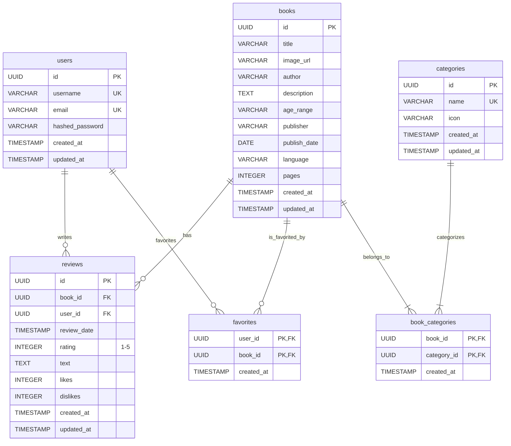

## バックエンドAPI設計とデータベーススキーマ (FastAPI & PostgreSQL)

### 1. データベーススキーマ (PostgreSQL)



**テーブル詳細:**

1.  **`users`**: ユーザー情報
    *   `id` (PK, UUID): ユーザーID
    *   `username` (VARCHAR, UNIQUE): ユーザー名
    *   `email` (VARCHAR, UNIQUE): メールアドレス
    *   `hashed_password` (VARCHAR): ハッシュ化されたパスワード
    *   `created_at`, `updated_at` (TIMESTAMP): 作成日時、更新日時

2.  **`books`**: 書籍情報
    *   `id` (PK, UUID): 書籍ID
    *   `title` (VARCHAR): タイトル
    *   `image_url` (VARCHAR): 画像URL
    *   `author` (VARCHAR): 著者
    *   `description` (TEXT): 説明
    *   `age_range` (VARCHAR): 対象年齢
    *   `publisher` (VARCHAR): 出版社
    *   `publish_date` (DATE): 出版日
    *   `language` (VARCHAR): 言語
    *   `pages` (INTEGER): ページ数
    *   `created_at`, `updated_at` (TIMESTAMP)

3.  **`categories`**: カテゴリ情報
    *   `id` (PK, UUID): カテゴリID
    *   `name` (VARCHAR, UNIQUE): カテゴリ名
    *   `icon` (VARCHAR): アイコン情報
    *   `created_at`, `updated_at` (TIMESTAMP)

4.  **`book_categories`**: 書籍とカテゴリの中間テーブル
    *   `book_id` (PK, FK, UUID): 書籍ID (`books`テーブルを参照)
    *   `category_id` (PK, FK, UUID): カテゴリID (`categories`テーブルを参照)
    *   `created_at` (TIMESTAMP)

5.  **`reviews`**: レビュー情報
    *   `id` (PK, UUID): レビューID
    *   `book_id` (FK, UUID): 書籍ID (`books`テーブルを参照)
    *   `user_id` (FK, UUID): ユーザーID (`users`テーブルを参照)
    *   `review_date` (TIMESTAMP): レビュー投稿日
    *   `rating` (INTEGER): 評価 (1-5)
    *   `text` (TEXT): レビュー本文
    *   `likes` (INTEGER, DEFAULT 0): いいね数
    *   `dislikes` (INTEGER, DEFAULT 0): よくないね数
    *   `created_at`, `updated_at` (TIMESTAMP)

6.  **`favorites`**: お気に入り情報 (中間テーブル)
    *   `user_id` (PK, FK, UUID): ユーザーID (`users`テーブルを参照)
    *   `book_id` (PK, FK, UUID): 書籍ID (`books`テーブルを参照)
    *   `created_at` (TIMESTAMP)

### 2. FastAPI APIエンドポイント案

**Pydanticモデル (主要なもの)**

```python
from pydantic import BaseModel, HttpUrl, Field
from typing import Optional, List
from datetime import date, datetime
from uuid import UUID

# --- User ---
class UserBase(BaseModel):
    username: str
    email: str

class UserCreate(UserBase):
    password: str

class User(UserBase):
    id: UUID
    created_at: datetime
    updated_at: datetime

    class Config:
        orm_mode = True

# --- Category ---
class CategoryBase(BaseModel):
    name: str
    icon: Optional[str] = None

class CategoryCreate(CategoryBase):
    pass

class Category(CategoryBase):
    id: UUID
    created_at: datetime
    updated_at: datetime

    class Config:
        orm_mode = True

# --- Book ---
class BookBase(BaseModel):
    title: str
    image_url: Optional[HttpUrl] = None
    author: Optional[str] = None
    description: Optional[str] = None
    age_range: Optional[str] = None
    publisher: Optional[str] = None
    publish_date: Optional[date] = None
    language: Optional[str] = None
    pages: Optional[int] = None

class BookCreate(BookBase):
    category_ids: List[UUID] = [] # 登録時にカテゴリIDのリストを受け取る

class BookUpdate(BookBase):
    title: Optional[str] = None # 更新時は全てオプショナル
    category_ids: Optional[List[UUID]] = None

class Book(BookBase):
    id: UUID
    categories: List[Category] = [] # 取得時にカテゴリ情報を含める
    average_rating: Optional[float] = None
    review_count: Optional[int] = None
    created_at: datetime
    updated_at: datetime

    class Config:
        orm_mode = True

# --- Review ---
class ReviewBase(BaseModel):
    rating: int = Field(..., ge=1, le=5)
    text: str

class ReviewCreate(ReviewBase):
    pass # book_id はパスパラメータ、user_id は認証情報から取得

class Review(ReviewBase):
    id: UUID
    book_id: UUID
    user: User # 投稿者情報
    review_date: datetime
    likes: int
    dislikes: int
    created_at: datetime
    updated_at: datetime

    class Config:
        orm_mode = True

# --- Token (for Auth) ---
class Token(BaseModel):
    access_token: str
    token_type: str

class TokenData(BaseModel):
    username: Optional[str] = None
```

**エンドポイント:**

**1. 認証 (`/auth`)**
    *   `POST /auth/register` -> `User`: ユーザー登録
        *   Request Body: `UserCreate`
    *   `POST /auth/login` -> `Token`: ログイン (JWTトークン発行)
        *   Request Body: `OAuth2PasswordRequestForm` (FastAPI標準)
    *   `GET /auth/me` -> `User`: 現在のユーザー情報取得 (要認証)

**2. 書籍 (`/books`)**
    *   `GET /books/` -> `List[Book]`: 書籍一覧取得 (ページネーション、フィルタリング、ソート対応)
        *   Query Params: `skip: int = 0`, `limit: int = 10`, `category_id: Optional[UUID] = None`, `author: Optional[str] = None`, `title_contains: Optional[str] = None`, `sort_by: Optional[str] = None`
    *   `POST /books/` -> `Book`: 書籍登録 (管理者権限)
        *   Request Body: `BookCreate`
    *   `GET /books/{book_id}` -> `Book`: 書籍詳細取得
    *   `PUT /books/{book_id}` -> `Book`: 書籍情報更新 (管理者権限)
        *   Request Body: `BookUpdate`
    *   `DELETE /books/{book_id}` -> `{"message": "Book deleted successfully"}`: 書籍削除 (管理者権限)

**3. カテゴリ (`/categories`)**
    *   `GET /categories/` -> `List[Category]`: カテゴリ一覧取得
    *   `POST /categories/` -> `Category`: カテゴリ登録 (管理者権限)
        *   Request Body: `CategoryCreate`
    *   `GET /categories/{category_id}` -> `Category`: カテゴリ詳細取得
    *   `PUT /categories/{category_id}` -> `Category`: カテゴリ情報更新 (管理者権限)
        *   Request Body: `CategoryBase`
    *   `DELETE /categories/{category_id}` -> `{"message": "Category deleted successfully"}`: カテゴリ削除 (管理者権限)
    *   `GET /categories/{category_id}/books` -> `List[Book]`: 特定カテゴリの書籍一覧取得

**4. レビュー (`/reviews` または書籍にネスト)**
    *   `GET /books/{book_id}/reviews` -> `List[Review]`: 特定書籍のレビュー一覧取得
    *   `POST /books/{book_id}/reviews` -> `Review`: レビュー投稿 (要認証)
        *   Request Body: `ReviewCreate`
    *   `GET /reviews/{review_id}` -> `Review`: レビュー詳細取得
    *   `PUT /reviews/{review_id}` -> `Review`: レビュー更新 (投稿者本人のみ)
        *   Request Body: `ReviewCreate` (rating, text のみ更新可能とするなど調整可)
    *   `DELETE /reviews/{review_id}` -> `{"message": "Review deleted successfully"}`: レビュー削除 (投稿者本人または管理者)
    *   `POST /reviews/{review_id}/like` -> `Review`: レビューに「いいね」 (要認証)
    *   `POST /reviews/{review_id}/dislike` -> `Review`: レビューに「よくないね」 (要認証)

**5. お気に入り (`/users/me/favorites`)**
    *   `GET /users/me/favorites` -> `List[Book]`: 自分のお気に入り書籍一覧取得 (要認証)
    *   `POST /users/me/favorites/{book_id}` -> `{"message": "Book added to favorites"}`: 書籍をお気に入りに追加 (要認証)
    *   `DELETE /users/me/favorites/{book_id}` -> `{"message": "Book removed from favorites"}`: 書籍をお気に入りから削除 (要認証)
